# Foundry VTT - Kryx RPG system

 
 
  

An implementation of the [Kryx RPG](https://www.kryxrpg.com/) system for [Foundry Virtual Tabletop](http://foundryvtt.com).

##### Based on: [Foundry VTT 5th Edition](https://gitlab.com/foundrynet/dnd5e)

---

## Setup

1. Open your foundry setup screen, go to "Game Systems" and "Install System"
2. In the bottom, paste the [manifest URL](https://github.com/itamarcu/FoundryVTT-KryxRPG/releases/latest/download/system.json): **`https://github.com/itamarcu/FoundryVTT-KryxRPG/releases/latest/download/system.json`**
3. Click "Install"
4. Wait patiently

# Features

### System

- Open-source and based on the very nice codebase of the 5e system, created by Atropos (main Foundry dev)
- Version number (mentioned above) is the latest relevant [Kryx RPG version](https://www.kryxrpg.com/changelog/2020), followed by a dash and then a simple incrementing version number. This system's version includes the Kryx RPG version because some system changes (such as renamed skills) require this repository to change too.
- Uses the imperial system and not the metric system (sorry folks, but I'm lazy; and you can change the units you see in the foundry settings anyways)

### Basic character setup
- Class, Archetype, Subclass
- Progression (e.g. Half Maneuvers Half Spells)
- Spell/Maneuver/Alchemy abilities
- Automatically show/hide options for all the above based on your choices (for quality of life)
- Really big Save/Cancel buttons because I'm too lazy to fix them

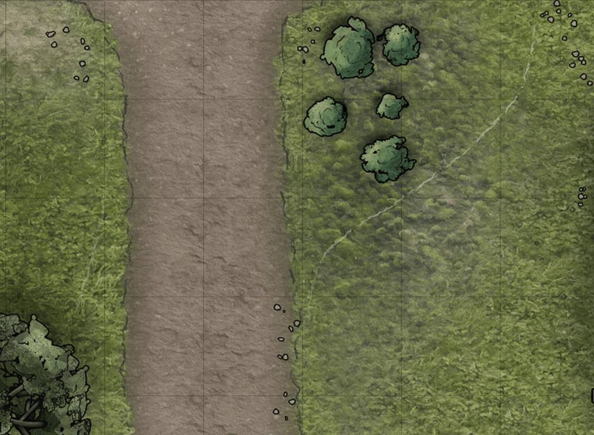

### Character sheet - front page

- Mana/Stamina/Catalysts ("main resources"), with maximum, limit, and DC automatically calculated
- Soak, below your Defense, if you have any armor that grants it
- Fortitude, Reflex, and Will saves; automatically calculated, you can pick proficiencies in them. Their styling is weird because I am bad at styling HTML/CSS and I tried to make it fit the default page size
- All KryxRPG skills (tied to default abilities; might add choice in the future). Skills have the three levels of proficiency (capable, proficient, expert)
- Functional second wind, short rest, and long rest
- Wounded and Dying can be tracked as numbers (they don't affect anything)
- Power Source can be selected (it doesn't affect anything)
- Known themes can be selected. When selecting themes for other sheet items, they will be limited by known themes

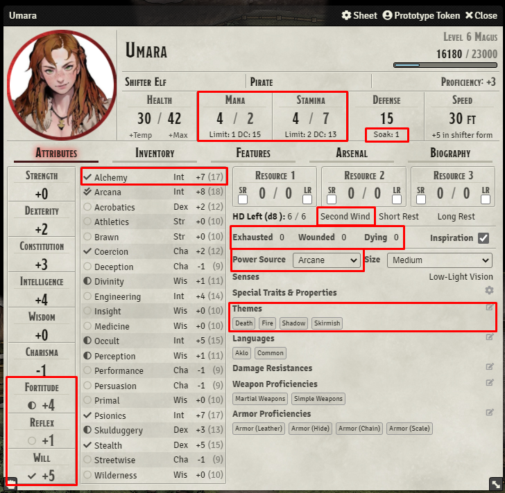

- "Allow picking unknown themes" setting added, if you don't want to limit your choices to known themes
- "Show damage immunity, attack bonus, etc" setting added, to show/hide a bunch of character traits that rarely matter
- "Only count equipped item weights" added, for people who want an easy way to select which of their items are in a bag that they aren't carrying during combat

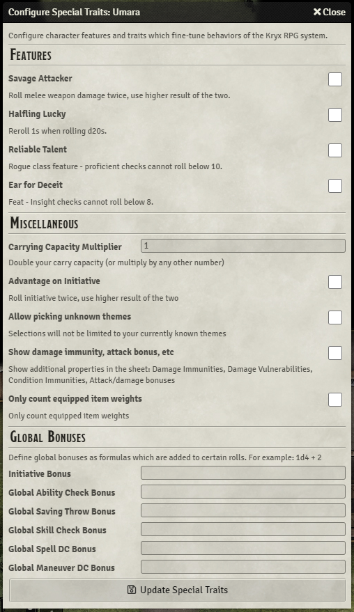

### Inventory

- All weapons and armors are up to date with KryxRPG rules
- Prices are in sp (silver pieces) instead of gp

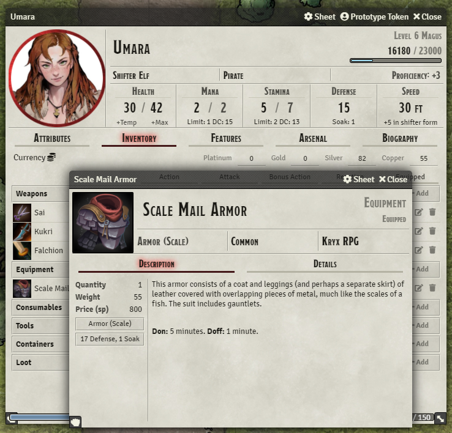

### Features

- Feats, class features, boons, etc. are all in one place
- Features can be set "active" if they have a duration (for example, fighting styles) 

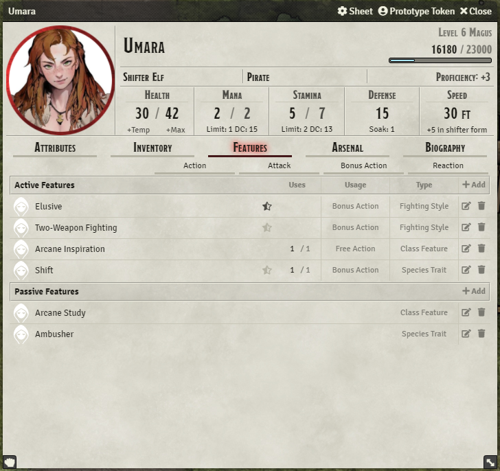

### Adding Powers (Concoctions, Maneuvers, and Spells)

- Writing "Concoctions, Maneuvers, and Spells" every time is tiring, so I'm using `Superpower` in the codebase and will be using "power" in this readme. You can mentally replace "power" with "spell" (or sometimes, "maneuver" or "concoction")
- The sheet tab containing the power is currently named the "Arsenal" (in D&D 5e it was the "Spellbook"). If you have a better name, feel free to suggest it!  
- The system currently features a small compendium with ~20 powers, each with an image (manually adding images is probably a bad precedent to set, I'm setting up too much work for myself)!
- A full compendium with all powers might eventually be available - I'll need to talk with the creator of KryxRPG ([@mlenser](https://github.com/mlenser)) to figure out a good solution that gives players everything they need without causing data ownership problems
- Each power shows a nice summary text when you hover over it. This summary text is based on the first line in the power description. This wasn't necessary for the system but I liked working on it

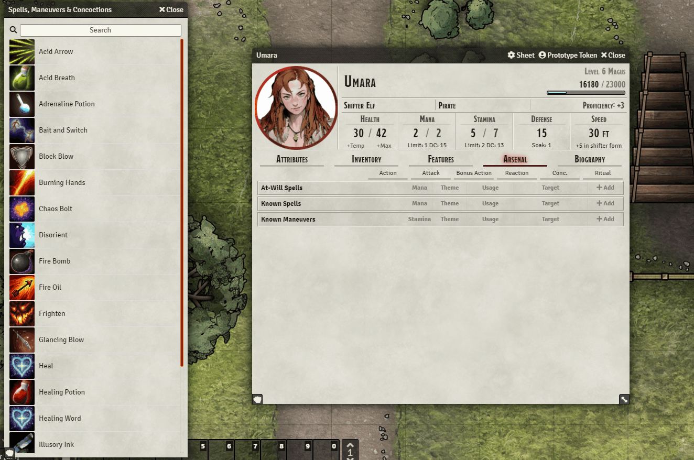

### Using Powers

- Power description (for spells in the included compendium) is a near-direct copy from the KryxRPG website
- Clicking the power name will take you to the corresponding page (e.g. [Produce Flame](https://www.kryxrpg.com/spells/produce-flame)).
- Damage rolls for cantrips automatically scale by your level

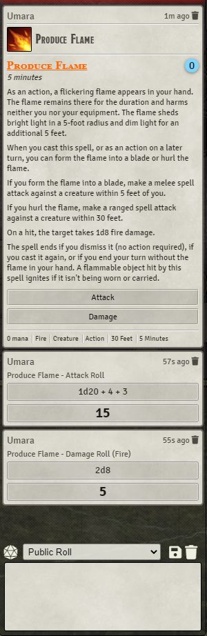

- Powers can be augmented/enhanced
- Power AoE scales according to standard KryxRPG area scaling
- Can choose between line and cone, for spells that allow both

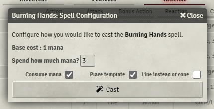

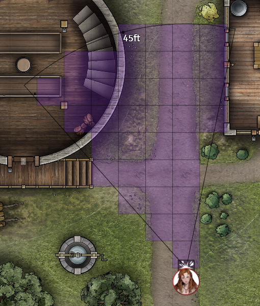

- Augments are automatically included in the damage calculation
- Additional effects are shown as a summary (not required, but it's nice to simplify some spells to "3d6 fire and burning 1")

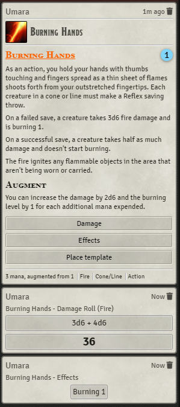

### Editing powers

- All of the above (and more) are editable
- A lot of options leftover from D&D 5e were removed/edited to fit the system (availability, components, activation cost, targeting, saving throw...)
- Targeting types such as "Large Sphere" refer to spheres with radius twice as big as normal
- "Damage" includes healing, temporary hit points, "chaos" damage, "same" damage, and "total health" (for powers like Sleep or Charming Presence)

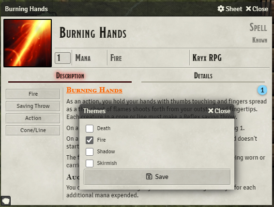

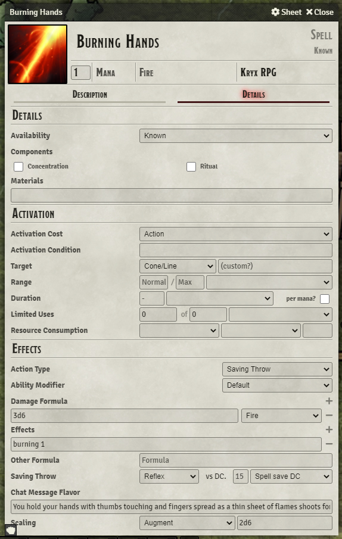

### NPC sheets

They are not really that interesting, they're pretty much like character sheets but with a few small differences (manually input Soak, calculate EXP by CR, a place for legendary actions). It's possible that I'll try to improve them to look more like monster sheets at some point, but right now they're functional (hopefully) and maybe modules will make them look better.

### Using Monsters

Currently, there is no easy way to import monsters. That's a planned feature for the future.  However, if you're looking for a fast-and-dirty solution, I recommend using the [Roll from Compendium](https://github.com/itamarcu/roll-from-compendium) module.  You can manually set up the basic ability scores of the monster, its "class" level (for purposes of mana/stamina amounts and limits), and then cast spells and use maneuvers straight out of the compendium, without needing to drag them to the monster. 

# Plans for the future

- Add all the other powers to the compendium (pending some planning and discussion)
- Add a way to import [monsters](https://www.kryxrpg.com/monsters)) from the website (or a compendium..?). Pending planning and discussion like the above
- Find and fix all of the bugs that undoubtedly exist in the code
- Consider some mechanism through which sheets can own powers from the compendium without creating copies that take up space and become outdated
- Add compatibility with popular D&D 5e modules (likely through ugly hacks or forks of every module)
- Find someone to fix all of my ugly styling and make everything pretty (hopefully including the code that does the same thing)
- Play with my friends more

# Support + Disclaimer

This is my first time working on a Foundry system, on a public project this big, or on an open project that others are actually going to rely on. I can promise you that there **will** be bugs in the system, and I can't promise any continued support because this is just a hobby of mine.

Incompatible updates will probably happen. Don't get attached to your data, back it up, and try not to update right before a game session. I wrote some basic migration code (already tested it on stuff like renaming/removing skills and themes), but there are still breaking changes that happen in the Kryx RPG system now and then, and I can't promise my attempts to migrate to them will be perfectly smooth. 

Please open issues in this github or message me in Discord - I'm `shem#0226`, and there's an official `#foundry-development` channel in the [Kryx RPG Discord](https://discord.gg/jP8byZF).